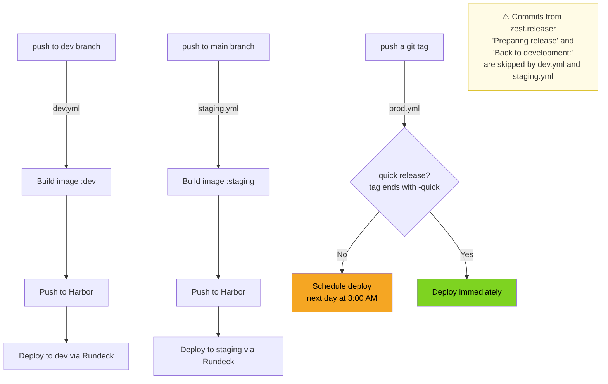
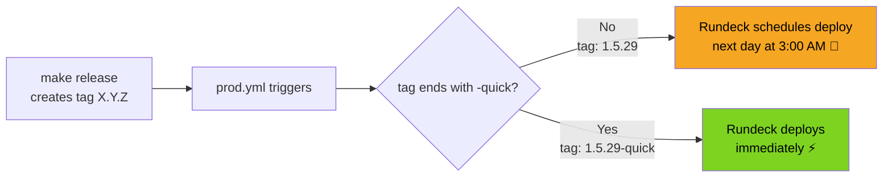
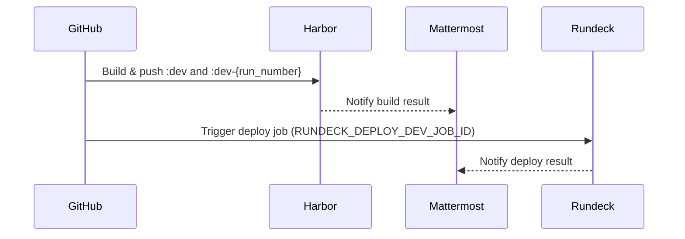
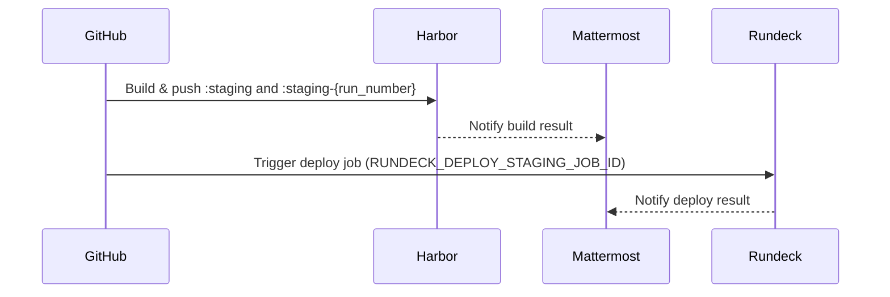

# CI/CD Workflows

This repository uses GitHub Actions to build, publish, and deploy the SmartWeb Docker image across three environments: **dev**, **staging**, and **production**.

All workflows run on self-hosted runners labelled `gha-runners-smartweb` and rely on three external tools:

- **Harbor** — Docker image registry
- **Rundeck** — deployment orchestration
- **Mattermost** — notifications

---

## Overview



---

## Making a release

### Prerequisites

- You are on the `main` branch with a clean working tree.
- `CHANGES.rst` has an entry for the version you are about to release.

### Version numbering (semver)

Versions follow `MAJOR.MINOR.PATCH`:

| Bump | When to use |
|------|-------------|
| `PATCH` (e.g. `1.5.28` → `1.5.29`) | Bug fixes, small improvements |
| `MINOR` (e.g. `1.5.x` → `1.6.0`) | New features, backwards-compatible changes |
| `MAJOR` (e.g. `1.x.x` → `2.0.0`) | Breaking changes |

### Running the release

```bash
make release
```

`zest.releaser` will interactively propose the next version. Confirm or adjust it. It will then automatically:

1. Set the release date in `CHANGES.rst`
2. Update the version pin in `versions.cfg`
3. Commit with message `"Preparing release X.Y.Z"` ← *skipped by CI*
4. Create git tag `X.Y.Z`
5. Commit with message `"Back to development: X.Y.(Z+1)"` ← *skipped by CI*

The two automatic commits are intentionally excluded from the CI builds (see the `if:` condition in `dev.yml` and `staging.yml`) to avoid spurious deployments.

### Standard release vs quick release



**Standard release** (`make release` → tag `X.Y.Z`): production is updated overnight, during low-traffic hours.

**Quick release** (`make release` → tag `X.Y.Z-quick`): use this only for **urgent hotfixes** that cannot wait until the next morning. Production is deployed right away.

---

## dev.yml — Publish and deploy dev image

**Trigger:** push to the `dev` branch (tags excluded), or manual via `workflow_dispatch`.

**Skip condition:** the job is skipped if the commit message contains `"Preparing release"` or `"Back to development:"` — these are the two automatic commits created by `zest.releaser` during a release cycle.

**Jobs:**



| Step | Action used |
|------|-------------|
| Build & push image | `IMIO/gha/build-push-notify@v6` |
| Deploy via Rundeck | `IMIO/gha/rundeck-notify@v6` |

**Image tags produced:**
- `:dev`
- `:dev-{run_number}`

---

## staging.yml — Publish and deploy staging image

**Trigger:** push to the `main` branch (tags excluded). No `workflow_dispatch`.

**Skip condition:** same as `dev.yml` — zest.releaser commits are ignored.

**Jobs:**



| Step | Action used |
|------|-------------|
| Build & push image | `IMIO/gha/build-push-notify@v6` |
| Deploy via Rundeck | `IMIO/gha/rundeck-notify@v6` |

**Image tags produced:**
- `:staging`
- `:staging-{run_number}`

---

## prod.yml — Promote staging to production

**Trigger:** any git tag push, or manual via `workflow_dispatch`.

This workflow does **not** rebuild the image. It promotes the already-validated `:staging` image to production by re-tagging it. The heavy lifting is delegated to a shared reusable workflow:
`IMIO/gha-workflows/.github/workflows/promote-staging-to-production.yml@v1`

**Quick release flag:** if the tag ends with `-quick` (e.g. `1.5.29-quick`), `quick_release` is set to `true` and the deployment happens immediately. Otherwise, Rundeck schedules it for the next day at 3:00 AM.

---

## Secrets and variables reference

### Repository secrets

| Secret | Used by | Purpose |
|--------|---------|---------|
| `HARBOR_URL` | all | Harbor registry base URL |
| `SMARTWEB_HARBOR_USERNAME` | all | Harbor login |
| `SMARTWEB_HARBOR_PASSWORD` | all | Harbor password |
| `SMARTWEB_MATTERMOST_WEBHOOK_URL` | all | Mattermost notification webhook |
| `RUNDECK_URL` | all | Rundeck instance URL |
| `SMARTWEB_RUNDECK_TOKEN` | all | Rundeck API token |
| `RUNDECK_DEPLOY_DEV_JOB_ID` | dev.yml | Rundeck job ID for dev deployment |
| `RUNDECK_DEPLOY_STAGING_JOB_ID` | staging.yml, testharden.yml | Rundeck job ID for staging deployment |

### Repository variables

| Variable | Used by | Purpose |
|----------|---------|---------|
| `IMAGE_NAME` | prod.yml | Docker image name (`web/smartweb/mutual`) |
| `IMAGE_TAG_STAGING` | prod.yml | Source tag to promote from staging |
| `IMAGE_TAG_PRODUCTION` | prod.yml | Target tag for production |
| `RUNDECK_JOB_ID` | prod.yml | Rundeck job ID for production deployment |
